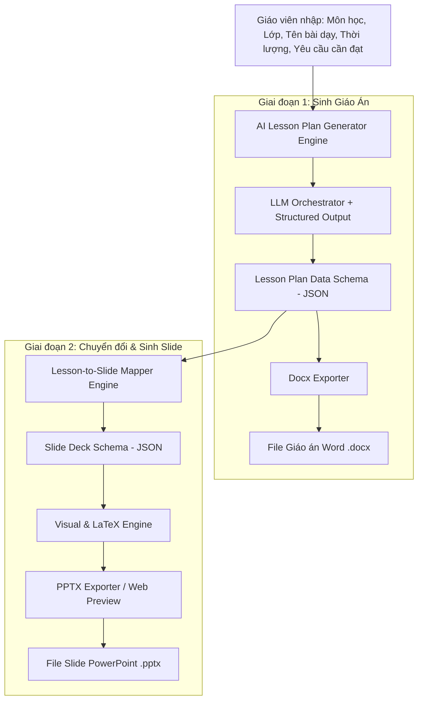

# Master Plan: Hệ thống AI Sinh Giáo Án & Slide Bài Giảng Tự Động Cho Giáo Viên

## 🎯 1. Phân tích Bài toán & Vấn đề Cần Giải Quyết (Core Problem Statement)

Để phát triển một giải pháp thực sự có giá trị cho giáo viên chứ không chỉ dừng lại ở một công cụ tạo văn bản chung chung, hệ thống cần giải quyết **4 vấn đề cốt lõi** sau:

### ❌ Vấn đề 1: Giáo án AI thường thiếu chuẩn hóa Sư phạm (Pedagogical Standard Alignment)
* **Thực trạng**: Các AI như ChatGPT/Claude hiện tại sinh giáo án rất tự do, thiếu cấu trúc bắt buộc của ngành giáo dục Việt Nam (như **Công văn 5512/BGDĐT** hay chương trình **GDPT 2018**).
* **Giải pháp**: AI phải tuân thủ nghiêm ngặt khung cấu trúc 4 hoạt động: *Mở đầu (Khởi động) -> Hình thành kiến thức -> Luyện tập -> Vận dụng*, đồng thời làm rõ Mục tiêu (Kiến thức, Năng lực, Phẩm chất) và Tiến trình hoạt động của GV & HS.

### ❌ Vấn đề 2: Khoảng cách giữa "Nội dung Giáo án" và "Trình chiếu Slide" (Content-to-Slide Gap)
* **Thực trạng**: Slide bài giảng **không phải** là bản sao chép (copy-paste) nguyên văn bản giáo án lên màn hình. Slide cần sự súc tích, điểm nhấn (bullet points), thời gian thực hiện, và phân bổ hợp lý theo từng trang.
* **Giải pháp**: Xây dựng một **Data Schema trung gian (Intermediate JSON Format)**. Giáo án sẽ được AI bóc tách và ánh xạ (mapping) chính xác thành các trang Slide (Title Slide, Concept Slide, Activity Slide, Quiz/Exercise Slide).

### ❌ Vấn đề 3: Xử lý Công thức & Hình ảnh Trực quan (Math, LaTeX & Visuals)
* **Thực trạng**: Các môn Tự nhiên (Toán, Lý, Hóa) cần công thức chuẩn (LaTeX) và hình vẽ minh họa. Các slide hiện nay thường bị lỗi hiển thị công thức hoặc thiếu hình minh họa bài học.
* **Giải pháp**: Tận dụng giải pháp từ dự án DATN hiện tại: Tự động render công thức LaTeX/KaTeX và tự động tạo/chèn hình ảnh (TikZ hoặc AI Image Gen) vào Slide.

### ❌ Vấn đề 4: Khả năng Chỉnh sửa & Xuất file thực tế (Editable Export Files)
* **Thực trạng**: Giáo viên không thể dùng file PDF hay web tĩnh để dạy. Họ bắt buộc cần file **Word (`.docx`)** cho Giáo án để nộp nhà trường và file **PowerPoint (`.pptx`)** cho Slide để chiếu trên lớp.
* **Giải pháp**: Xây dựng bộ công cụ Export (Docx Generator & PPTX Generator) cho phép giữ nguyên định dạng chuyên nghiệp, tùy chỉnh được template/màu sắc.

---

## 🏗️ 2. Kiến trúc Hệ thống Tổng quan (System Architecture)



---

## 📑 3. Thiết kế Data Schema Cốt lõi (Core Schemas)

### 3.1. Schema Giáo án (Lesson Plan Schema - Công văn 5512)
```json
{
  "lesson_title": "Bài 3: Cấp số cộng",
  "subject": "Toán học",
  "grade": 11,
  "duration_minutes": 45,
  "objectives": {
    "knowledge": ["Nắm được định nghĩa cấp số cộng", "Nhớ công thức số hạng tổng quát"],
    "skills": ["Tính được công sai d", "Tìm được số hạng thứ n"],
    "attitudes_qualities": ["Chủ động, tích cực tham gia hoạt động nhóm"]
  },
  "equipment": ["Máy chiếu", "Phiếu học tập số 1"],
  "activities": [
    {
      "activity_number": 1,
      "name": "Mở đầu (Khởi động)",
      "time_minutes": 5,
      "goal": "Tạo tình huống xuất phát dẫn đến định nghĩa cấp số cộng",
      "teacher_action": "Giao bài toán dãy số tiền tiết kiệm hàng tháng...",
      "student_action": "Thảo luận cặp đôi và trả lời...",
      "expected_product": "Dãy số có đặc điểm số sau hơn số trước một giá trị không đổi",
      "assessment": "GV nhận xét và dẫn dắt vào bài mới"
    },
    {
      "activity_number": 2,
      "name": "Hình thành kiến thức mới",
      "time_minutes": 20,
      "sub_sections": [
        {
          "heading": "1. Định nghĩa",
          "content_latex": "Cấp số cộng là dãy số \\((u_n)\\) trong đó: \\(u_{n+1} = u_n + d\\)",
          "key_points": ["d gọi là công sai", "Khi d = 0 thì cấp số cộng là dãy số không đổi"]
        }
      ]
    }
  ]
}
```

### 3.2. Schema Slide Bài Giảng (Slide Deck Schema)
```json
{
  "presentation_title": "Bài 3: Cấp số cộng",
  "theme": "modern_blue",
  "slides": [
    {
      "slide_index": 1,
      "type": "TITLE_SLIDE",
      "title": "BÀI 3: CẤP SỐ CỘNG",
      "subtitle": "Môn Toán - Lớp 11",
      "teacher_note": "Chào học sinh và kiểm tra sĩ số"
    },
    {
      "slide_index": 2,
      "type": "WARM_UP_SLIDE",
      "title": "HOẠT ĐỘNG KHỞI ĐỘNG",
      "content_bullets": [
        "Quan sát dãy số tiết kiệm: 100k, 150k, 200k, 250k...",
        "Em có nhận xét gì về sự chênh lệch giữa 2 tháng liên tiếp?"
      ],
      "layout": "TWO_COLUMN_IMAGE_TEXT",
      "image_prompt": "piggy bank animation style",
      "teacher_note": "Dành 3 phút cho học sinh thảo luận cặp đôi"
    },
    {
      "slide_index": 3,
      "type": "KNOWLEDGE_SLIDE",
      "title": "1. ĐỊNH NGHĨA CẤP SỐ CỘNG",
      "main_definition": "\\(u_{n+1} = u_n + d, \\quad \\forall n \\in \\mathbb{N}^*\\)",
      "key_takeaways": [
        "d: Công sai của cấp số cộng",
        "Nếu d > 0: Dãy số tăng",
        "Nếu d < 0: Dãy số giảm"
      ],
      "layout": "CONCEPT_HIGHLIGHT"
    }
  ]
}
```

---

## 🛠️ 4. Stack Công Nghệ Đề Xuất (Tech Stack)

| Thành phần | Công nghệ lựa chọn | Lý do sử dụng |
| :--- | :--- | :--- |
| **Backend Framework** | **FastAPI (Python)** | Xử lý bất đồng bộ mượt mà, dễ tích hợp các thư viện AI/ML của Python. Tái sử dụng được kiến trúc ASGI từ dự án DATN hiện tại. |
| **AI / LLM Orchestration** | **LangChain / LangGraph + Pydantic** | Ép kiểu đầu ra LLM ra chuẩn JSON Schema (`Structured Output`) không lo lỗi cú pháp. |
| **LLM Model** | **GPT-4o / Claude 3.5 Sonnet** | Phù hợp nhất cho việc hiểu ngữ cảnh sư phạm tiếng Việt và xuất JSON chính xác. |
| **Word Exporter** | **`python-docx` + Jinja2 Templates** | Tự động tạo file Word `.docx` chuẩn mẫu Công văn 5512 với bảng biểu đẹp mắt. |
| **PowerPoint Exporter** | **`python-pptx`** hoặc **`Marp CLI`** | Chuyển đổi trực tiếp cấu trúc JSON/Markdown Slide sang file PowerPoint `.pptx` chuẩn chỉnh font/màu sắc. |
| **Math Rendering** | **KaTeX / MathJax** (Web) & **Latex2Image** (Slide) | Hiển thị công thức toán sắc nét trên cả Web Preview và file Slide PowerPoint. |
| **Frontend** | **React / Next.js + TailwindCSS** | Làm giao diện người dùng chuyên nghiệp: Xem trước Giáo án & Xem thử Slide theo thời gian thực (Real-time preview). |

---

## 🚀 5. Lộ Trình Phát Triển Chi Tiết (Project Roadmap)

### 📌 Giai đoạn 1: Xây dựng AI Sinh Giáo Án Chuẩn (Core Lesson Plan Engine)
* [ ] **Bước 1.1**: Định nghĩa bộ Prompt System và Pydantic Output Model cho Giáo án chuẩn Công văn 5512 (Môn học, Lớp, Mục tiêu, 4 Hoạt động).
* [ ] **Bước 1.2**: Viết API FastAPI `/api/v1/lesson-plan/generate` tiếp nhận yêu cầu từ giáo viên và gọi LLM để sinh JSON Giáo án.
* [ ] **Bước 1.3**: Tích hợp thư viện `python-docx` viết module chuyển đổi JSON Giáo án thành file Word `.docx` có bảng biểu chuẩn quy định của BGD&ĐT.
* [ ] **Bước 1.4**: Xây dựng UI Web cơ bản để giáo viên nhập thông tin bài học, chỉnh sửa Giáo án dạng Text/Form và tải về file Word.

### 📌 Giai đoạn 2: Động cơ Ánh xạ Giáo Án sang Slide (Lesson Plan to Slide Mapper)
* [ ] **Bước 2.1**: Thiết kế thuật toán bóc tách từ `Lesson Plan JSON` $\rightarrow$ `Slide Deck JSON`.
  * *Mở đầu* $\rightarrow$ 1-2 Slide Khởi động.
  * *Hình thành kiến thức* $\rightarrow$ Các Slide định nghĩa, khái niệm, ví dụ.
  * *Luyện tập/Vận dụng* $\rightarrow$ Các Slide câu hỏi trắc nghiệm/bài tập có đáp án ẩn/hiện.
* [ ] **Bước 2.2**: Bổ sung trường `teacher_note` (Lời thoại/Ghi chú cho giáo viên) tự động cho từng trang Slide.
* [ ] **Bước 2.3**: Làm màn hình Web Slide Preview (sử dụng Reveal.js hoặc Marp) để giáo viên xem trước Slide trình chiếu trực tiếp trên trình duyệt.

### 📌 Giai đoạn 3: Tự động xuất Slide PowerPoint (`.pptx`) & Tùy biến Giao diện
* [ ] **Bước 3.1**: Phát triển module `python-pptx` để chuyển đổi `Slide Deck JSON` thành file `.pptx` thật.
* [ ] **Bước 3.2**: Xây dựng bộ Template mẫu (Modern, Classic, Creative, Minimalist) cho phép giáo viên chọn màu sắc/style của Slide.
* [ ] **Bước 3.3**: Tích hợp render công thức toán LaTeX sang dạng ảnh minh họa chèn vào Slide PPTX.

### 📌 Giai đoạn 4: Tính năng Nâng cao (Advanced Features)
* [ ] **Bước 4.1**: AI gợi ý trò chơi ngắn (Mini-game/Quiz) chèn vào giữa bài giảng (Kahoot style).
* [ ] **Bước 4.2**: AI tự động tạo sơ đồ tư duy (Mindmap) tóm tắt cuối bài dạy bằng Mermaid.js.
* [ ] **Bước 4.3**: Cho phép upload file PDF/SGK cũ $\rightarrow$ AI tự chuyển đổi thành Giáo án & Slide mới.

---

## 💡 6. Đòn bẩy có thể kế thừa từ dự án DATN hiện tại

Dù đây là dự án mới, bạn hoàn toàn có thể tái sử dụng các kinh nghiệm & mô đun sau từ repo DATN:
1. **Kiến trúc ASGI / FastAPI & Docker Setup**: Tái sử dụng cấu trúc `main.py` và `docker-compose.yml` để dựng backend nhanh chóng.
2. **Kỹ thuật Render LaTeX & TikZ**: Tái sử dụng module `MCP_Geometry/tikz_builder.py` để xử lý hình vẽ toán học cho môn Toán/Lý.
3. **Module Chuyển đổi Markdown/Docx**: Tham khảo thư mục `Agent/MD to DOCX/` để viết exporter xuất file Word chuẩn cho giáo án.
4. **Langfuse Integration**: Kế thừa `Chatbot/llm.py` và `observability.py` để quản lý các Prompt sinh giáo án/slide và theo dõi chi phí LLM.
